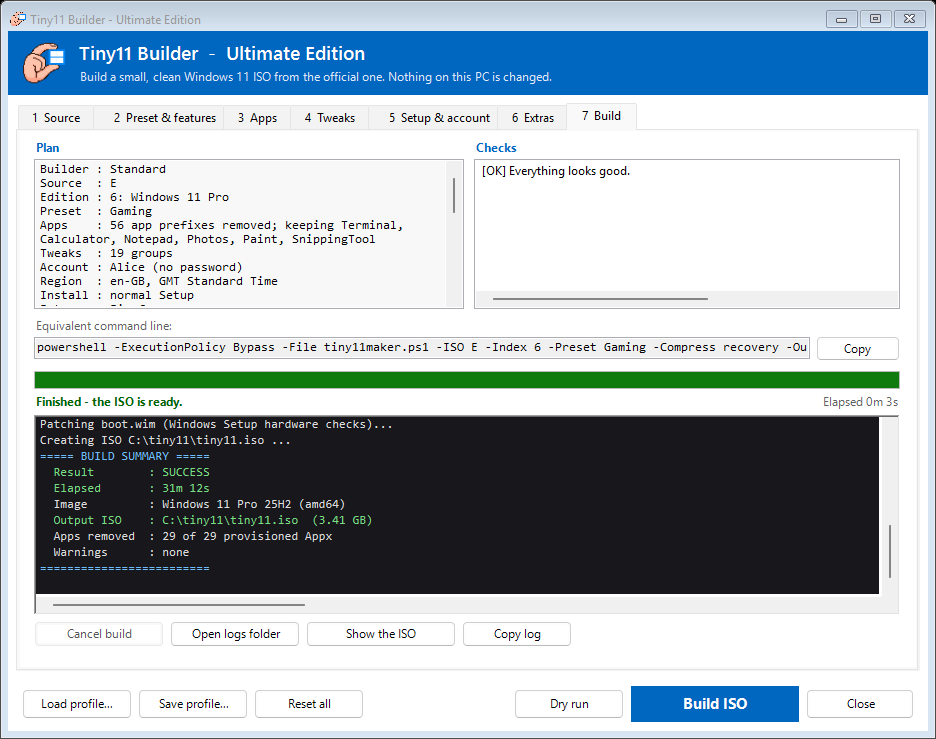

# Tiny11 Builder — Ultimate Edition (2026)

[](https://github.com/NairoDorian/tiny11builder_2026/actions/workflows/ci.yml)


[](LICENSE)

**Turn Microsoft's official Windows 11 ISO into a small, clean, private one**, with a
graphical builder that exposes every option, or with one command line.



The ISOs it produces:

- have no bloat apps, Edge, OneDrive, Copilot, Recall, Widgets, ads or suggestions;
- send minimal telemetry;
- install without a Microsoft account or a network connection;
- skip the TPM / Secure Boot / CPU / RAM checks.

Windows Update, Defender and the Store keep working unless you choose otherwise.

This project is a fork of [ntdevlabs/tiny11builder](https://github.com/ntdevlabs/tiny11builder).
Its full history is kept on `main`, and the 2026 edition follows as regular commits on top.
It also merges the best work of 15 community forks (see [Credits](#history-and-credits)).

> [!IMPORTANT]
> **The builder never changes the PC it runs on.** It works on a copy of the ISO:
> - It mounts the image in a work folder and edits the image's *offline* registry
>   (temporarily loaded as `HKLM\z*`), then writes a new ISO.
> - The registry helpers refuse any path outside those offline hives, and refuse to write
>   at all unless an image hive is loaded.
> - The only optional host-side change is **Faster build (Defender exclusion)**. It is off by
>   default and removed again when the build ends.

---

## Contents

- [Highlights](#highlights)
- [Quick start](#quick-start)
- [The GUI](#the-gui)
- [Standard or Core](#standard-or-core)
- [Presets](#presets)
- [Command line](#command-line)
- [What a build does](#what-a-build-does)
- [After installing](#after-installing)
- [Customising](#customising)
- [Troubleshooting](#troubleshooting)
- [Project layout](#project-layout)
- [Development](#development)
- [History and credits](#history-and-credits)

---

## Highlights

| | |
|---|---|
| **Every option in one window** | A 7-tab GUI with a live log and stage progress. The build runs inside it, and Cancel cleans up. |
| **Current Windows** | 25H2, 24H2, 23H2 and 22H2 media, x64 and ARM64, `install.wim` or `install.esd` ISOs, any language. |
| **AI and ads off** | Policies for Copilot, Recall, Click to Do, the Settings agent, generative AI in Paint, Notepad and Edge, Widgets, Bing search, Start recommendations and "finish setting up" nags. |
| **No surprise reinstalls** | Removed apps are *deprovisioned*, and the Outlook, Dev Home, Teams and Edge re-installers are blocked. |
| **Your first boot, your way** | A local admin account (or create one in OOBE), locale, time zone, computer name, a zero-touch install for VMs, a browser installed at first sign-in, and your own scripts. |
| **Transparent** | Every registry value is listed in [docs/TWEAKS.md](docs/TWEAKS.md), every app in [docs/APPS.md](docs/APPS.md). Each ISO gets a `.json` manifest and a `.sha256` file. |
| **Safe by construction** | Options are validated before any work starts. The registry cannot be written outside the image, and failures roll back. The downloaded `oscdimg.exe` is checksum-pinned. |
| **Tested** | About 1,750 automated checks: tweak catalog, presets, answer files, removal planning, mocked build stages, and the GUI driven end to end. CI runs on Windows PowerShell 5.1. |

---

## Quick start

1. Download a Windows 11 ISO from [microsoft.com/software-download/windows11](https://www.microsoft.com/software-download/windows11).
2. Double-click **`LAUNCH_TINY11.bat`** and press **1** (graphical builder). It asks for administrator rights.
3. In **Source**, pick the ISO, click **Load editions** and choose an edition, for example *Windows 11 Pro*.
4. Optionally adjust the other tabs, then click **Build ISO**. A build takes about 20–40 minutes.
5. Write the ISO to a USB stick with [Rufus](https://rufus.ie) (keep its default options) or
   attach it to a VM.

From an elevated PowerShell prompt, the same in one line:

```powershell
.\tiny11maker.ps1 -ISO C:\iso\Win11_25H2_English_x64.iso -Edition Pro -Yes
```

The ISO is written next to the scripts as `tiny11.iso` (`tiny11core.iso` for Core), with
`tiny11.iso.json` (what was built and how) and `tiny11.iso.sha256`. Logs go to `logs\`.

### Requirements

- Windows 10 or 11 (x64 or ARM64) and an **administrator** account.
- **Windows PowerShell 5.1** (`powershell.exe`, built into Windows). PowerShell 7 is not
  supported, because the DISM module targets 5.1.
- About **25 GB free** on an **NTFS** drive: 1.5 × the image size, at least 20 GB. The GUI
  shows the free space and warns before you start.
- `oscdimg.exe` is taken from the Windows ADK if installed. Otherwise it is downloaded once
  from Microsoft's symbol server and verified against a pinned SHA-256.

---

## The GUI

`tiny11gui.ps1` (option **1** of `LAUNCH_TINY11.bat`) exposes **every** builder option.

- It remembers your last settings in `gui-settings.json` (never the password).
- **Save profile / Load profile** stores a whole configuration, so you can rebuild it for
  every new Windows release in two clicks.
- Everything maps 1:1 to the command line; the Build tab shows the exact command.

| Tab | What you set |
|---|---|
| **1 Source** | ISO file or drive; edition list with build, architecture, language and size; Standard or Core builder; output ISO; work drive (with free space); compression; quick test build; boot without "Press any key"; dry run |
| **2 Preset & features** | Preset, plus each of its 22 flags as a checkbox (hover for details). Changed flags become a custom preset automatically. Load and save preset files. |
| **3 Apps** | The full removal list by category (uncheck to keep an app), your own package prefixes, import/export of lists, the optional apps to keep, and "keep everything". |
| **4 Tweaks** | All 28 registry tweak groups and what enables each. Uncheck to skip a group; check a greyed one to turn on its flag. Every value of the selected group is shown. |
| **5 Setup & account** | Local admin and password, or create the account in OOBE. Language/keyboard, time zone, computer name, zero-touch install, custom answer file. **Preview or save the generated `autounattend.xml`.** |
| **6 Extras** | .NET 3.5, a driver folder (the `.inf` files are counted), a browser, payload scripts, the low-RAM profile, no driver updates, and the Defender exclusion on the build PC. |
| **7 Build** | Plan, checks (errors block the build; warnings explain trade-offs) and the command line to copy. During the build: stage progress, elapsed time, a colour-coded log, **Cancel** (stops the builder and discards the mounted image), and buttons to open the logs or show the ISO. |

| | |
|---|---|
|  |  |
|  |  |
|  |  |

The build runs as a hidden, non-interactive `powershell.exe`. Its arguments go through a
temporary file that is deleted immediately, so a password never appears on a command line.

---

## Standard or Core

| | **Standard** — `tiny11maker.ps1` | **Core** — `tiny11Coremaker.ps1` |
|---|---|---|
| For | PCs, laptops, long-lived VMs | disposable VMs, test rigs, CI |
| Windows Update, language packs, features | keep working | **impossible** after the build |
| Defender | on (off only with Minimal-VM) | removed |
| WinRE / "Reset this PC" | kept | removed |
| WinSxS | cleaned (`/StartComponentCleanup /ResetBase`) | rebuilt with only the servicing stack |
| Edge WebView2 | kept (removed only with Minimal-VM) | removed |
| Default preset | Default | Minimal-VM |

---

## Presets

A preset is a set of on/off flags ([`presets/*.json`](presets)). The
[tweak matrix](docs/TWEAKS.md#which-groups-each-preset-applies) shows which registry groups
each preset applies, and [docs/APPS.md](docs/APPS.md#preset-dependent) shows which apps depend
on the preset.

| Preset | For | Compared with Default |
|---|---|---|
| **Default** | everyone | Removes bloat apps, Edge, OneDrive and AI features; telemetry off. Keeps the Store, Defender, WebView2 and Mark-of-the-Web. |
| **Gaming** | gaming PCs | Keeps the Xbox app, Game Bar and Xbox sign-in. Adds the Ultimate Performance power plan, raw mouse input, fast shutdown and firewall rules that block telemetry. |
| **PrivacyPlus** | privacy first | Adds firewall rules that block telemetry and fast shutdown. Defender stays on but sends no cloud reports or samples. |
| **Minimal-VM** | lab VMs | Also removes the Store, WebView2 and Defender (**no antivirus**), and turns off Mark-of-the-Web. |

To make your own preset, change the checkboxes in the GUI and click **Save as preset**, or
copy a JSON file. Then use it with `-Preset .\my-preset.json`. Missing flags inherit from
Default.

---

## Command line

Both builders take the same options. Core ignores `-LowRam`, `-DisableDriverUpdates` and
`-Custom`, and asks about .NET 3.5 when run interactively. Run `Get-Help .\tiny11maker.ps1 -Full`
for the built-in help.

```powershell
# Check everything first, build nothing
.\tiny11maker.ps1 -ISO C:\iso\Win11.iso -Edition Pro -DryRun

# Gaming preset, keep Paint and Snipping Tool, install Firefox at first sign-in
.\tiny11maker.ps1 -ISO E -Edition Pro -Preset Gaming -Keep Paint,SnippingTool -Browser Firefox -Yes

# Unattended VM install that WIPES DISK 0, with a UK locale and a named account
.\tiny11maker.ps1 -ISO E -Edition Pro -ZeroTouch -User Alice -Password "S3cret!" `
    -Locale en-GB -TimeZone "GMT Standard Time" -ComputerName TINY11-VM -Yes

# Smallest possible image for throw-away VMs
.\tiny11Coremaker.ps1 -ISO E -Edition Pro -Yes
```

**Source and output**

| Option | Meaning |
|---|---|
| `-ISO <path\|letter>` | A Windows 11 `.iso` file, or the drive letter of a mounted ISO or USB stick |
| `-Edition <name>` / `-Index <n>` | The edition to build, e.g. `Pro`, `Home`, `"Windows 11 Pro N"` (the exact name or its last word), or its index |
| `-SCRATCH <letter>` | NTFS drive for the work folders (default: the scripts' drive) |
| `-OutputIso <path>` | Where to write the ISO |
| `-Compress recovery\|max\|fast\|none` | `recovery` (default) writes `install.esd`, the smallest ISO; the others write `install.wim` |
| `-Fast` | Fast compression and no component cleanup (quick test builds) |
| `-NoPrompt` | The ISO boots straight into Setup without "Press any key" (implied by `-ZeroTouch`) |

**What is removed**

| Option | Meaning |
|---|---|
| `-Preset <name\|file.json>` | `Default`, `Gaming`, `PrivacyPlus`, `Minimal-VM`, or your own JSON file |
| `-Keep a,b` / `-Remove a,b` | Optional apps: Terminal, Calculator, Notepad, Photos, Paint, Camera, SoundRecorder, StickyNotes, Clock, MediaPlayer, MoviesTV, SnippingTool |
| `-KeepApps` | Remove no provisioned app at all |
| `-PackageList <file>` | Your own list instead of `removePackage.txt` |
| `-Custom` | Pick the apps to remove interactively in the console (and decide on Edge and OneDrive) |
| `-SkipTweak Id1,Id2` | Leave out tweak groups; the ids are in [docs/TWEAKS.md](docs/TWEAKS.md) |
| `-LowRam` | Extra trimming for 1–2 GB PCs (Windows Update and Defender untouched) |
| `-DisableDriverUpdates` | Windows Update will not install drivers |

**What is added**

| Option | Meaning |
|---|---|
| `-EnableNetFx3` | Enable .NET Framework 3.5 from the ISO |
| `-DriverPath <folder>` | Inject `.inf` drivers into Windows and into Setup (e.g. Intel RST/VMD, so Setup can see the disk) |
| `-Browser Firefox\|Chrome` | Silent install at the first sign-in; waits for the network |
| `-Payload` | Run your scripts from `payload\packages` at the end of Setup ([details](payload/README.md)) |

**Installation and first start** (built into the ISO's answer file)

| Option | Default | Meaning |
|---|---|---|
| `-User` / `-Password` | `User` / empty | Local administrator created by Setup, signed in automatically once. The password is stored Base64-obfuscated, and the answer files are deleted after the first sign-in. |
| `-InteractiveOobe` | off | Create no account; Windows asks for a local user name instead |
| `-Locale xx-YY` | ask in OOBE | Language, region and keyboard (e.g. `de-DE`); skips those setup pages |
| `-TimeZone <id>` | `UTC` | Any id from `tzutil /l`, e.g. `"W. Europe Standard Time"` |
| `-ComputerName <name>` | random | 1–15 letters, digits or `-` |
| `-ZeroTouch` | off | **Wipes disk 0** and installs with no questions (UEFI/GPT). For VMs and test PCs. |
| `-UnattendFile <xml>` | — | Your own answer file; its image index is pointed at the exported edition |

**Build behaviour**

| Option | Meaning |
|---|---|
| `-DryRun` | Validate everything and print the plan; change nothing |
| `-Yes` | Never prompt. Needs `-ISO`, and `-Edition`/`-Index` for multi-edition ISOs |
| `-DefenderExclusion` | Temporarily exclude the work folders from this PC's Defender scan; removed at the end |

In PowerShell, lists work as `-Keep Paint,Camera`; from `cmd`, write `-Keep "Paint,Camera"`.

---

## What a build does

1. **Validates every option first** (preset, app names, tweak ids, user and computer name,
   paths, free space), so a typo fails in seconds rather than after 30 minutes.
2. Recovers from a crashed previous run: leftover registry hives and mount points.
3. Copies the ISO without the multi-GB install image and **exports only the chosen edition**.
   This also converts `install.esd` media.
4. Mounts the image and removes:
   - provisioned apps;
   - Edge (plus WebView2 with Minimal-VM or Core) and OneDrive;
   - legacy capabilities, and the handwriting and speech packs. OCR, Narrator voices and
     spell-check stay.
5. Loads the image registry and applies the **[tweak catalog](docs/TWEAKS.md)**: 28 groups,
   170 values.
   - It also marks the removed apps as deprovisioned.
   - It removes 16 telemetry scheduled tasks, reading their IDs from the image itself, so this
     works on every build.
6. Writes the answer file, `SetupComplete.cmd` and `FirstLogon.cmd` into the image.
7. Cleans the component store, commits, and exports `install.esd` (LZMS) or `install.wim`.
8. Patches `boot.wim` so Windows Setup skips the hardware checks, and adds your drivers.
9. Writes `autounattend.xml` and runs `oscdimg`. The ISO boots on BIOS and UEFI, or UEFI only
   for ARM64. The build then checks the ISO and writes the manifest and SHA-256.

If anything fails, the build unloads the hives, discards the mounted image, ejects the ISO and
removes any temporary exclusions, so the next run starts clean. From the GUI, **Cancel** does
the same.

---

## After installing

- Setup creates your account and signs in once automatically, unless you chose to create the
  account in OOBE.
- **Software:** `winget` (App Installer) is always kept, e.g. `winget install Mozilla.Firefox 7zip.7zip VideoLAN.VLC`.
- **Logs on the installed system:** `C:\Windows\Setup\Tiny11\setupcomplete.log` and `firstlogon.log`.
- **Undoing a tweak:** every value is listed in [docs/TWEAKS.md](docs/TWEAKS.md). Most are
  policies under `HKLM\SOFTWARE\Policies`; delete the value to restore the Windows default.
- **Getting Edge back:** delete `HKLM\SOFTWARE\Policies\Microsoft\EdgeUpdate`, then run `winget install Microsoft.Edge`.

---

## Customising

| What | Where |
|---|---|
| Apps removed by default | [`removePackage.txt`](removePackage.txt), one package-name prefix per line (or the Apps tab) |
| Optional apps and their defaults | `Get-OptionalUtilities` in [`lib/tiny11utils.psm1`](lib/tiny11utils.psm1) |
| Registry tweaks | [`data/tweaks.psd1`](data/tweaks.psd1): add a value to a group, or a new group with a `When` flag |
| Presets | [`presets/*.json`](presets), or **Save as preset** in the GUI |
| Scripts run after Setup | [`payload/packages/`](payload) with `-Payload` |
| Browser installers | [`Browsers/`](Browsers) |

After editing the catalog, the presets or the answer-file generator, run
`.\scripts\update-generated.ps1`. It refreshes `docs/TWEAKS.md`, `docs/APPS.md`, the reference
answer files and the module manifests.

---

## Troubleshooting

| Symptom | Fix |
|---|---|
| "reg unload … failed" / a hive is still loaded | Close Registry Editor and any Explorer window on the work folder. The next run unloads leftover hives automatically. |
| "Failed to commit/unmount" | Usually antivirus scanning the work folder: turn on the Defender exclusion. `dism /Cleanup-Mountpoints` clears stale mounts. |
| The build is very slow | Put the work drive on an SSD and turn on the Defender exclusion; use a quick build for tests. `recovery` compression alone takes 10–20 min. |
| "Load editions" fails | Run the GUI as administrator (the launcher does this); the ISO must contain `sources\install.wim` or `install.esd`. |
| Setup asks for a product key | Choose the edition you own. Setup activates with the key stored in your firmware. |
| Setup cannot see the disk (Intel VMD/RST laptops) | Point the drivers folder at the extracted Intel RST "F6" drivers. |
| The ISO does not boot on an old BIOS PC | x64 ISOs boot on BIOS, but zero-touch partitions for UEFI/GPT. Install interactively instead. |
| Anything else | Run a dry run, then read the log in `logs\`. It records every value written. |

---

## Project layout

```text
LAUNCH_TINY11.bat         Menu launcher (GUI / Standard / Core), elevates itself
Run.bat                   Runs tiny11maker.ps1 with your arguments
tiny11gui.ps1             Graphical builder (every option, live build log)
tiny11maker.ps1           Standard (serviceable) builder
tiny11Coremaker.ps1       Core (minimal, non-serviceable) builder
tiny11LegacyProfile.ps1   Compatibility shim for the old low-RAM profile
removePackage.txt         Apps removed by default
autounattend*.xml         Reference answer files (generated)
data/tweaks.psd1          Registry tweak catalog, the single source of truth
presets/*.json            Build presets
lib/tiny11utils.psm1      Build library: DISM/registry helpers, catalog engine, answer-file
                          generator, removal planning, shared build stages, ISO creation
lib/tiny11gui.psm1        Windows Forms window, state -> builder arguments, build runner
payload/                  Your post-install scripts (-Payload)
Browsers/                 Browser installers run at the first sign-in (-Browser)
docs/                     TWEAKS.md and APPS.md (generated), GUI screenshots
scripts/                  Tests, parse check, linter, generators, test fixtures
repos/                    Reference forks (git-ignored, for study only)
```

---

## Development

```powershell
.\scripts\parse-check.ps1         # every file parses, every command resolves
.\scripts\test-core-helpers.ps1   # ~1,750 checks, no admin rights and no ISO needed
.\scripts\update-generated.ps1    # docs, reference answer files, manifests (-Check fails if stale)
.\scripts\linter.ps1              # PSScriptAnalyzer, high-signal rules
.\scripts\update-screenshots.ps1  # re-render docs\gui-*.png (window-only rendering)
```

The tests cover:

- every catalog entry and the presets;
- the generated and reference answer files, checked against an allow-list of real unattend
  settings (one unknown element makes Windows Setup abort);
- app, capability and package removal planning;
- the build stages, run against mocked DISM and registry functions;
- the GUI logic, the build launcher, and the whole window driven end to end with a fake
  builder that never touches the system.

CI runs all of this on Windows PowerShell 5.1. A real ISO build needs admin rights and a
Windows ISO: test those changes in a VM (dry run first) and mention the build you used in the
pull request. See [CONTRIBUTING.md](CONTRIBUTING.md) and [CHANGELOG.md](CHANGELOG.md).

---

## History and credits

`main` holds the complete history of [ntdevlabs/tiny11builder](https://github.com/ntdevlabs/tiny11builder)
(100 commits), followed by the 2026 edition as regular commits, so every change can be traced
back to the original with `git log` / `git blame`.

Ideas and fixes were studied in these projects and ported (they are cloned under `repos/` for
reference):

| Project | Ideas used |
|---|---|
| [ntdevlabs/tiny11builder](https://github.com/ntdevlabs/tiny11builder) | The original: offline debloat, hardware bypass, answer file |
| [chrisGrando/tiny11maker-reforged](https://github.com/chrisGrando/tiny11maker-reforged) | GUI, launcher, ISO auto-mount, final `install.esd` export |
| [vinisebold/tiny11builder-revamped](https://github.com/vinisebold/tiny11builder-revamped) | Shared module, TaskCache ACL takeover, cleanup trap, app selector |
| [zPoche/tiny11builder-v2](https://github.com/zPoche/tiny11builder-v2) | Pre-flight checks, dry run, quick builds, ARM64, the mount-folder fix |
| [YmlyZA/tiny11builder](https://github.com/YmlyZA/tiny11builder) | Tests, linter, build summary, keep/remove utilities, zero-touch |
| [namnguyen97x/tiny-auto-builder](https://github.com/namnguyen97x/tiny-auto-builder) | Presets, driver injection, retrying dismount/unload |
| [bluecloud122/tiny11builder](https://github.com/bluecloud122/tiny11builder) | Low-RAM profile, ISO sanity checks |
| [MOPELotus/tiny11builder](https://github.com/MOPELotus/tiny11builder) | Payload / SetupComplete design, OOBE page tweaks, stale-state recovery |
| [SamHimmy/tiny11builder](https://github.com/SamHimmy/tiny11builder) | 24H2/25H2 AI, Recall and Widgets policies |
| [keepitupkitty/tiny11builder](https://github.com/keepitupkitty/tiny11builder) | Paint/Notepad AI policies, Edge and OneDrive leftovers |
| [user129233/tiny11builder](https://github.com/user129233/tiny11builder) | Specialize-pass commands, answer-file cleanup after sign-in |
| [DFveloper/DFwindows11_builder](https://github.com/DFveloper/DFwindows11_builder) | Browser installers, language-independent ACL handling |
| [prismatecas-ui/tiny11builder](https://github.com/prismatecas-ui/tiny11builder) | GUI option ideas, installed-apps inventory |
| [bedlaj/tiny11builder](https://github.com/bedlaj/tiny11builder) | ADK lookup through the registry |
| [AhmedLolyProductions/Loly11](https://github.com/AhmedLolyProductions/Loly11) | Package-list entries |

## License

MIT, see [LICENSE](LICENSE). Windows is a trademark of Microsoft. This project ships no
Microsoft files; you supply your own ISO.
