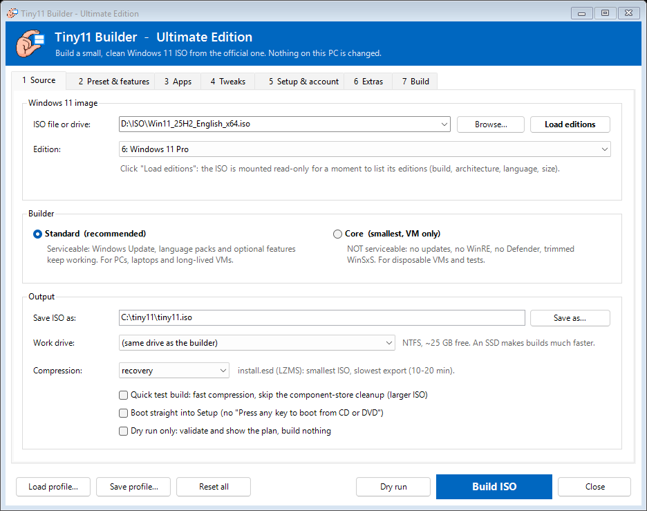
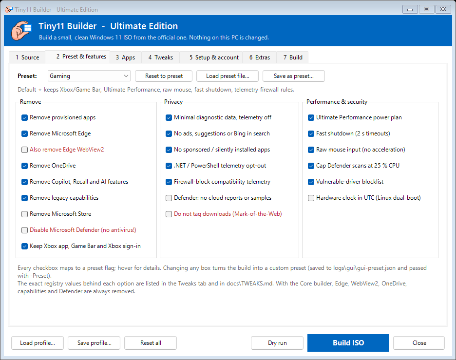
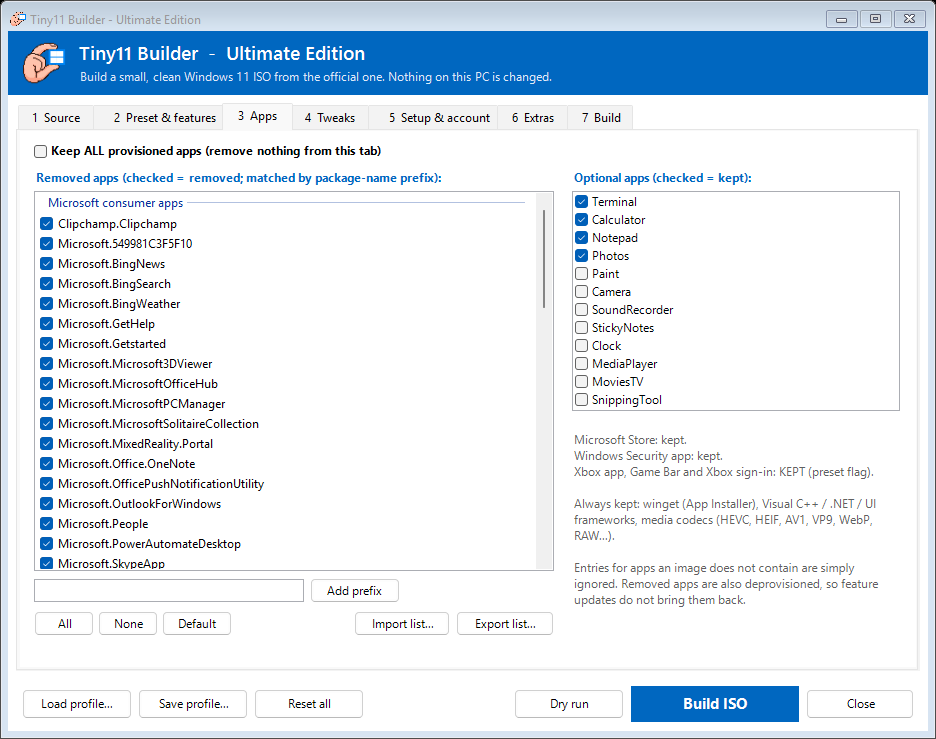
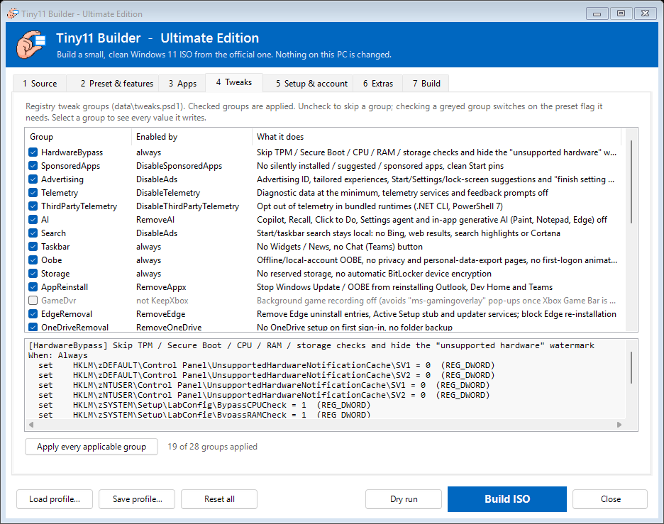
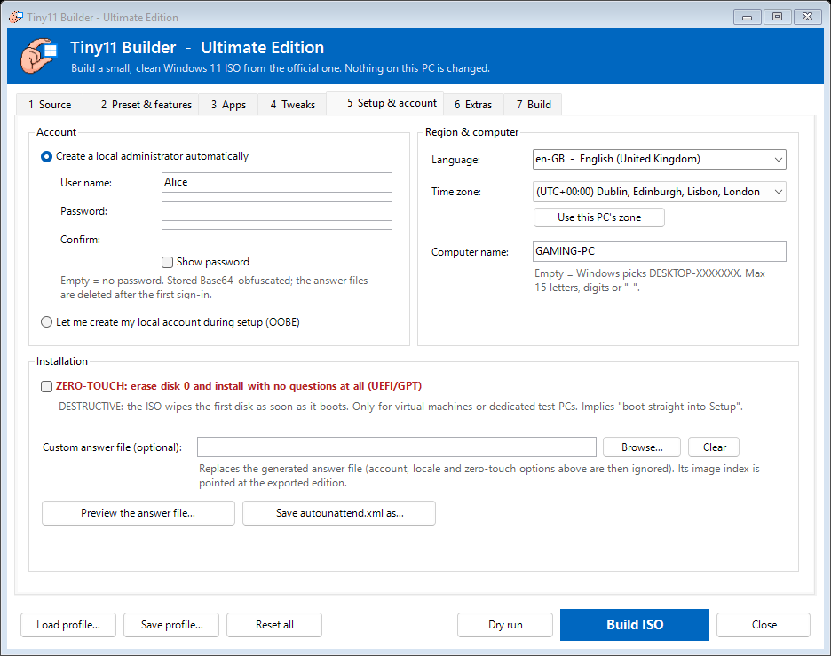
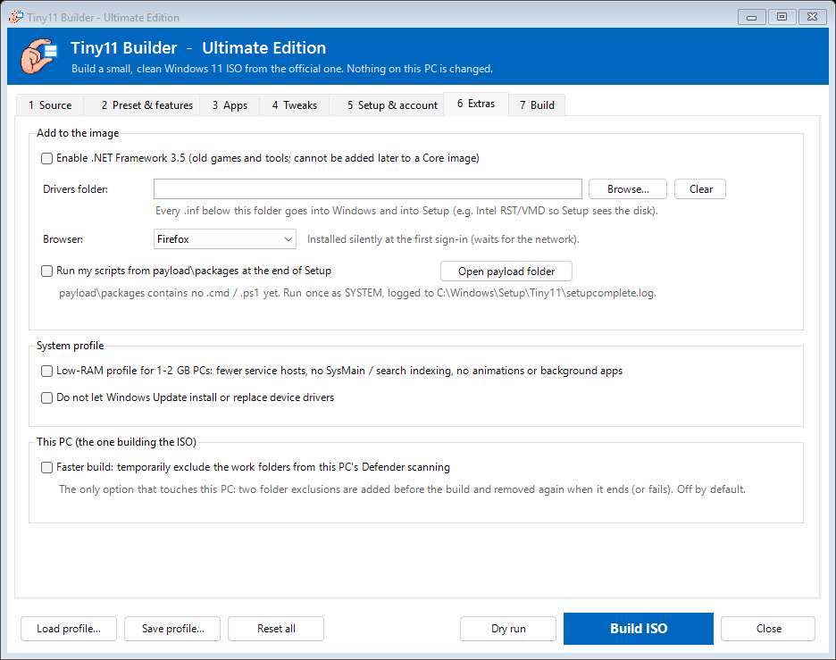
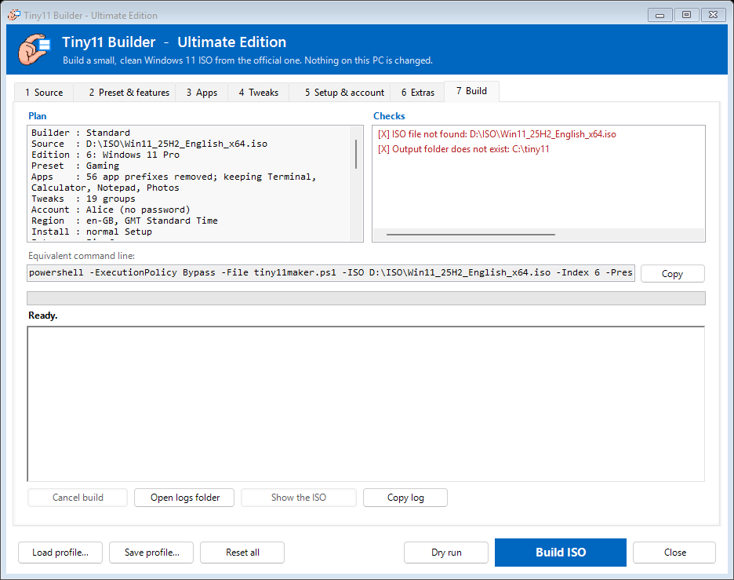

# Tiny11 Builder — Ultimate Edition (2026)

Build a small, clean Windows 11 ISO from Microsoft's official ISO. The result
has no bloat apps, no Edge, OneDrive, Copilot or Recall, no ads or suggestions,
minimal telemetry, and an install that skips the Microsoft-account and
network requirement and the TPM / Secure Boot / CPU checks. It keeps Windows Update,
Defender and the Store unless you ask otherwise.

Supports Windows 11 **25H2, 24H2**, 23H2 and 22H2 media, **x64 and ARM64**, and
`install.wim` or `install.esd` ISOs. It merges the best work of the upstream
[ntdevlabs/tiny11builder](https://github.com/ntdevlabs/tiny11builder) and
15 community forks (see [Credits](#credits)).

> **The builder never changes the PC it runs on.** It works on a copy of the ISO:
> it mounts the image in a work folder, edits the image's *offline* registry
> (loaded temporarily as `HKLM\z*`) and writes a new ISO. The registry helpers refuse
> any path outside those offline hives, and refuse to write at all unless an image
> hive is loaded. The only optional host-side change is `-DefenderExclusion`,
> which is off by default and removed again at the end of the build.

---

## Contents

- [Quick start](#quick-start)
- [The GUI](#the-gui)
- [Requirements](#requirements)
- [Standard vs Core](#standard-vs-core)
- [Presets](#presets)
- [Options](#options)
- [What a build does](#what-a-build-does)
- [After installing](#after-installing)
- [Customising](#customising)
- [Troubleshooting](#troubleshooting)
- [Project layout](#project-layout)
- [Development](#development)
- [Credits](#credits)

---

## Quick start

1. Download a Windows 11 ISO from [microsoft.com/software-download/windows11](https://www.microsoft.com/software-download/windows11).
2. Double-click **`LAUNCH_TINY11.bat`** and choose **[1] Graphical builder**.
3. Pick the ISO, click **Load editions**, choose an edition and click **Build ISO**.
   The build runs inside the window with a live log and progress bar.



Every option is available in the window - see [The GUI](#the-gui).

Or from an elevated PowerShell prompt:

```powershell
# Pro edition, defaults, no questions
.\tiny11maker.ps1 -ISO C:\iso\Win11_25H2.iso -Edition Pro -Yes

# Check everything first without building
.\tiny11maker.ps1 -ISO C:\iso\Win11_25H2.iso -Edition Pro -DryRun

# Gaming preset, keep Paint and Snipping Tool, install Firefox at first sign-in
.\tiny11maker.ps1 -ISO E -Edition Pro -Preset Gaming -Keep Paint,SnippingTool -Browser Firefox -Yes

# Fully unattended VM install (WIPES DISK 0), French locale, named account
.\tiny11maker.ps1 -ISO E -Edition Pro -ZeroTouch -User Alice -Password "S3cret!" `
    -Locale fr-FR -TimeZone "Romance Standard Time" -ComputerName TINY11-VM -Yes

# Smallest possible image for throw-away VMs
.\tiny11Coremaker.ps1 -ISO E -Edition Pro -Yes
```

The scripts elevate themselves (UAC prompt). The ISO is written next to the
scripts as `tiny11.iso` (or `tiny11core.iso`), together with
`tiny11.iso.json` (what was built and how) and `tiny11.iso.sha256`. Build logs
go to `logs\`.

---

## The GUI

`tiny11gui.ps1` (option **[1]** of `LAUNCH_TINY11.bat`) exposes **every** builder option in
seven tabs, remembers your last settings (`gui-settings.json`, never the password) and runs
the build itself. Everything it does maps 1:1 to a command line, shown on the Build tab.

| Tab | What you set |
|---|---|
| **1 Source** | ISO file or drive, edition list with build / architecture / language / size, Standard or Core builder, output ISO, work drive (with free space), compression, quick build, boot without "Press any key", dry run |
| **2 Preset & features** | preset, plus every preset flag as a checkbox (hover for details); customised flags become a custom preset automatically; load/save preset files |
| **3 Apps** | the full removal list grouped by category (uncheck to keep, add your own prefixes, import/export lists), optional apps to keep, "keep everything" |
| **4 Tweaks** | all 28 registry tweak groups with what enables them: uncheck to skip one, check a greyed one to enable its flag; the exact values of the selected group |
| **5 Setup & account** | local admin + password (with confirmation) or create the account in OOBE, language/keyboard, time zone, computer name, zero-touch, custom answer file, **preview / save the generated `autounattend.xml`** |
| **6 Extras** | .NET 3.5, driver folder (counts the `.inf` files), browser, payload scripts, low-RAM profile, no driver updates, Defender exclusion on the build PC |
| **7 Build** | plan summary, validation checks (errors block the build, warnings explain trade-offs), the equivalent command line (copy it), then the build: stage progress, elapsed time, colour-coded live log, **Cancel** (stops the builder and discards the mounted image), open the logs / show the ISO |

| | |
|---|---|
|  |  |
|  |  |
|  |  |

Profiles (**Save profile / Load profile**) store the whole configuration, so a tuned setup can
be rebuilt with every new Windows release in two clicks. The builder runs as a hidden,
non-interactive `powershell.exe`; its arguments are passed through a temporary file that is
deleted immediately, so a password never appears on a command line.

---

## Requirements
- Windows 10 or 11 (x64 or ARM64) and an **administrator** account.
- **Windows PowerShell 5.1** (`powershell.exe`, built in). PowerShell 7 is not supported
  because the DISM module targets 5.1.
- About **25 GB free** on an **NTFS** drive (the script checks: 1.5 × the image size,
  at least 20 GB). Choose another drive with `-SCRATCH D`.
- `oscdimg.exe`: taken from the Windows ADK if installed, otherwise downloaded once
  from Microsoft's symbol server and **verified against a pinned SHA-256**.

---

## Standard vs Core

| | `tiny11maker.ps1` (Standard) | `tiny11Coremaker.ps1` (Core) |
|---|---|---|
| Target | daily-driver PCs, laptops, VMs | disposable VMs, test rigs, CI |
| Windows Update, language packs, features | keep working | **impossible** after build |
| Defender | on (except the Minimal-VM preset) | removed |
| WinRE / "Reset this PC" | kept | removed |
| WinSxS | cleaned (`/StartComponentCleanup /ResetBase`) | rebuilt with only the servicing stack |
| Edge WebView2 | kept (except Minimal-VM) | removed |
| Default preset | `Default` | `Minimal-VM` |

---

## Presets

A preset is a set of on/off flags (`presets/*.json`). Everything a preset does is
listed per group in **[docs/TWEAKS.md](docs/TWEAKS.md)**; which apps go is in
**[docs/APPS.md](docs/APPS.md)**.

| Preset | For | Differences from Default |
|---|---|---|
| **Default** | everyone | removes bloat apps, Edge, OneDrive and AI features; telemetry off; keeps Store, Defender, WebView2 and Mark-of-the-Web |
| **Gaming** | gaming PCs | keeps the Xbox app, Game Bar and Xbox sign-in; Ultimate Performance power plan; raw mouse input; fast shutdown; telemetry firewall rules |
| **PrivacyPlus** | privacy-minded users | telemetry firewall rules; Defender stays on but sends no cloud reports or samples; fast shutdown |
| **Minimal-VM** | lab VMs | also removes the Store, WebView2 and Defender (**no antivirus**); no Mark-of-the-Web |

Your own preset: copy a JSON file, change the flags and pass its path,
`-Preset .\my-preset.json`. Missing flags inherit from Default.

---

## Options

Both builders accept the same options (Core ignores `-LowRam`, `-DisableDriverUpdates` and `-Custom`).
`Get-Help .\tiny11maker.ps1 -Full` shows the full help.

**Source**

| Option | Meaning |
|---|---|
| `-ISO <path\|letter>` | Windows 11 `.iso` file or the drive letter of a mounted ISO/USB |
| `-Edition <name>` | e.g. `Pro`, `Home`, `Education`, `"Windows 11 Pro N"` (exact name or last word) |
| `-Index <n>` | image index instead of `-Edition` |
| `-SCRATCH <letter>` | NTFS drive for the work folders (default: the scripts' drive) |

**What is removed**

| Option | Meaning |
|---|---|
| `-Preset <name\|file.json>` | `Default`, `Gaming`, `PrivacyPlus`, `Minimal-VM` or your own JSON |
| `-Keep a,b` / `-Remove a,b` | optional apps: Terminal, Calculator, Notepad, Photos, Paint, Camera, SoundRecorder, StickyNotes, Clock, MediaPlayer, MoviesTV, SnippingTool |
| `-Custom` | pick the apps to remove from a list (and whether Edge / OneDrive go) |
| `-KeepApps` | do not remove any provisioned app |
| `-PackageList <file>` | use your own list instead of `removePackage.txt` |
| `-SkipTweak Id1,Id2` | leave out tweak groups (ids in [docs/TWEAKS.md](docs/TWEAKS.md)) |
| `-LowRam` | extra trimming for 1–2 GB PCs (Windows Update and Defender untouched) |
| `-DisableDriverUpdates` | Windows Update will not install drivers |

**Adding things**

| Option | Meaning |
|---|---|
| `-EnableNetFx3` | enable .NET Framework 3.5 (Core asks interactively; it cannot be added later) |
| `-DriverPath <folder>` | inject `.inf` drivers into Windows and into Setup (e.g. Intel RST/VMD so Setup sees the disk) |
| `-Browser Firefox\|Chrome` | install a browser silently at the first sign-in |
| `-Payload` | run your scripts from `payload\packages` at the end of Setup ([payload/README.md](payload/README.md)) |

**Installation / first start** (baked into the ISO's answer file)

| Option | Default | Meaning |
|---|---|---|
| `-User` / `-Password` | `User` / empty | local administrator created by Setup; signs in automatically once. The password is stored Base64-obfuscated and the answer files are deleted after the first sign-in |
| `-InteractiveOobe` | off | create no account; Windows asks for a local user name instead |
| `-Locale xx-YY` | ask in OOBE | language, region and keyboard (e.g. `de-DE`); skips those pages |
| `-TimeZone <id>` | `UTC` | any id from `tzutil /l`, e.g. `"W. Europe Standard Time"` |
| `-ComputerName` | random | 1–15 letters, digits or `-` |
| `-ZeroTouch` | off | **wipes disk 0** and installs with no questions (UEFI/GPT). VMs and test PCs only |
| `-UnattendFile <xml>` | — | use your own answer file (its image index is repointed to 1) |

**Output / build**

| Option | Meaning |
|---|---|
| `-OutputIso <path>` | where to write the ISO |
| `-Compress recovery\|max\|fast\|none` | `recovery` (default) = `install.esd`, smallest; the others write `install.wim` |
| `-Fast` | fast compression, no component cleanup (quick test builds) |
| `-NoPrompt` | boot straight into Setup, without "Press any key" (implied by `-ZeroTouch`) |
| `-DefenderExclusion` | temporarily exclude the work folders from this PC's Defender scan (faster; removed afterwards) |
| `-DryRun` | validate everything and print the plan; changes nothing |
| `-Yes` | never prompt (needs `-ISO`, plus `-Edition`/`-Index` for multi-edition ISOs) |

Lists work as `-Keep Paint,Camera` in PowerShell and as `-Keep "Paint,Camera"` from `cmd`.

---

## What a build does

1. **Validates** every option first (preset, `-Keep` names, tweak ids, user and
   computer name, paths), so typos fail in seconds, not after 30 minutes.
2. Recovers from any crashed previous run (left-over hives and mount points).
3. Mounts the ISO, copies it **without** the multi-GB install image, and
   **exports only the chosen edition**. This also converts `install.esd` media.
4. Mounts the image and removes provisioned apps, Edge (plus WebView2 on
   Minimal-VM/Core), OneDrive and optional capabilities. Handwriting and speech
   packs go; OCR, Narrator voices and spell-check stay.
5. Loads the offline registry and applies the **[tweak catalog](docs/TWEAKS.md)**.
   It also marks removed apps as *deprovisioned* (feature updates will not
   reinstall them) and removes the telemetry scheduled tasks. The task GUIDs
   are read from the image, so this works on every build.
6. Writes the answer file into the image, plus `SetupComplete.cmd` and
   `FirstLogon.cmd` for first-boot actions.
7. Cleans the component store, commits, and exports `install.esd`
   (LZMS compression) or `install.wim`.
8. Patches `boot.wim` so Windows Setup skips the hardware checks, and adds
   drivers if you asked for them.
9. Writes `autounattend.xml` and runs `oscdimg`. The ISO boots on BIOS and UEFI;
   ARM64 ISOs are UEFI-only. The build then checks the ISO and writes the
   manifest and SHA-256.

If anything fails, a trap unloads the hives, discards the mounted image, ejects
the ISO and removes temporary exclusions, so the next run starts clean.

---

## After installing

- Setup creates the account and signs in once automatically (unless you used `-InteractiveOobe`).
- **Installing software:** `winget` (App Installer) is always kept:
  `winget install Mozilla.Firefox 7zip.7zip VideoLAN.VLC`.
- **Logs** inside the installed system:
  - `C:\Windows\Setup\Tiny11\setupcomplete.log`
  - `C:\Windows\Setup\Tiny11\firstlogon.log`
- **Undoing a tweak:** every value is listed in [docs/TWEAKS.md](docs/TWEAKS.md).
  Most are policies under `HKLM\SOFTWARE\Policies`; delete the value to restore
  the Windows default.
- **Getting Edge back:** `winget install Microsoft.Edge`, then delete
  `HKLM\SOFTWARE\Policies\Microsoft\EdgeUpdate`.

---

## Customising

| What | Where |
|---|---|
| Apps removed by default | [`removePackage.txt`](removePackage.txt) (one package-name prefix per line) |
| Optional apps and their defaults | `Get-OptionalUtilities` in `lib/tiny11utils.psm1` |
| Registry tweaks | [`data/tweaks.psd1`](data/tweaks.psd1): add a value to a group or add a group with a `When` flag |
| Presets | [`presets/*.json`](presets) |
| Scripts run after Setup | [`payload/packages/`](payload) + `-Payload` |
| Browser installers | [`Browsers/`](Browsers) |

After editing the catalog, presets or the answer-file generator, run
`.\scripts\update-generated.ps1` to refresh `docs/` and the reference answer files.

---

## Troubleshooting

| Symptom | Fix |
|---|---|
| "reg unload … failed" / hive still loaded | Close Registry Editor and Explorer windows on the work folder. The next run unloads left-over hives automatically. |
| "Failed to commit/unmount" | Usually antivirus scanning the work folder: retry with `-DefenderExclusion`. `dism /Cleanup-Mountpoints` clears stale mounts. |
| Very slow build | Use an SSD for `-SCRATCH`, `-DefenderExclusion`, or `-Fast` for test builds. `recovery` compression alone takes 10–20 minutes. |
| Setup asks for a product key | Use `-Edition` / `-Index` for the edition you own. Setup activates with the key stored in your firmware. |
| Setup cannot see the disk (Intel VMD/RST laptops) | `-DriverPath` pointing at the extracted Intel RST F6 drivers |
| ISO does not boot on an old BIOS PC | x64 ISOs boot on BIOS, but `-ZeroTouch` partitions for UEFI/GPT. Install interactively instead. |
| Something else | Run with `-DryRun` first, then read the log in `logs\`. It records every value written. |

---

## Project layout

```text
tiny11maker.ps1           Standard (serviceable) builder
tiny11Coremaker.ps1       Core (minimal, non-serviceable) builder
tiny11gui.ps1             Graphical builder (every option, live build log)
tiny11LegacyProfile.ps1   Compatibility shim for the old low-RAM profile
LAUNCH_TINY11.bat         Menu launcher (GUI / Standard / Core), self-elevating
Run.bat                   Runs tiny11maker.ps1 with your arguments
removePackage.txt         Apps removed by default
autounattend*.xml         Reference answer files (generated)
data/tweaks.psd1          Registry tweak catalog (single source of truth)
presets/*.json            Build presets
lib/tiny11utils.psm1      Build library: DISM/registry helpers, catalog engine,
                          answer-file generator, removal planning, build stages
lib/tiny11gui.psm1        Windows Forms window, state -> arguments, build runner
payload/                  Your post-install scripts (-Payload)
Browsers/                 First-sign-in browser installers (-Browser)
docs/                     TWEAKS.md and APPS.md (generated)
scripts/                  Tests, parse check, linter, doc generator
repos/                    Reference forks (git-ignored, for study only)
```

---

## Development

```powershell
.\scripts\parse-check.ps1        # every file parses, every command resolves
.\scripts\test-core-helpers.ps1  # ~1750 checks incl. GUI (fake builder), no admin / no ISO
.\scripts\update-generated.ps1   # refresh docs + reference answer files (-Check in CI)
.\scripts\linter.ps1             # PSScriptAnalyzer, high-signal rules
```

The tests run the build stages against mocked DISM and registry functions. They
also validate every catalog entry and check both the generated and the
reference answer files against an allow-list of real unattend settings (a
single unknown element makes Windows Setup abort). CI runs all four scripts
on Windows PowerShell 5.1 and renders the GUI. See
[CONTRIBUTING.md](CONTRIBUTING.md) and [CHANGELOG.md](CHANGELOG.md).

---

## Credits

Built by studying these projects (cloned under `repos/`):

| Project | Ideas used |
|---|---|
| [ntdevlabs/tiny11builder](https://github.com/ntdevlabs/tiny11builder) | the original: offline debloat, hardware bypass, answer file |
| [chrisGrando/tiny11maker-reforged](https://github.com/chrisGrando/tiny11maker-reforged) | GUI, launcher, ISO auto-mount, final `install.esd` export |
| [vinisebold/tiny11builder-revamped](https://github.com/vinisebold/tiny11builder-revamped) | shared module, TaskCache ACL takeover, safe cleanup trap, app selector |
| [zPoche/tiny11builder-v2](https://github.com/zPoche/tiny11builder-v2) | pre-flight checks, `-DryRun`, `-Fast`, ARM64, mount-folder fix |
| [YmlyZA/tiny11builder](https://github.com/YmlyZA/tiny11builder) | tests, linter, build summary, `-Keep`/`-Remove`, zero-touch |
| [namnguyen97x/tiny-auto-builder](https://github.com/namnguyen97x/tiny-auto-builder) | presets, driver injection, retrying dismount/unload |
| [bluecloud122/tiny11builder](https://github.com/bluecloud122/tiny11builder) | low-RAM profile, ISO sanity checks |
| [MOPELotus/tiny11builder](https://github.com/MOPELotus/tiny11builder) | payload/SetupComplete design, OOBE page tweaks, stale-state recovery |
| [SamHimmy/tiny11builder](https://github.com/SamHimmy/tiny11builder) | 24H2/25H2 AI, Recall and Widgets policies |
| [keepitupkitty/tiny11builder](https://github.com/keepitupkitty/tiny11builder) | Paint/Notepad AI policies, Edge and OneDrive leftovers |
| [user129233/tiny11builder](https://github.com/user129233/tiny11builder) | specialize-pass commands, answer-file cleanup after sign-in |
| [DFveloper/DFwindows11_builder](https://github.com/DFveloper/DFwindows11_builder) | browser installers, language-independent ACL handling |
| [prismatecas-ui/tiny11builder](https://github.com/prismatecas-ui/tiny11builder) | GUI option ideas, installed-apps inventory |
| [bedlaj/tiny11builder](https://github.com/bedlaj/tiny11builder) | ADK lookup through the registry |
| [AhmedLolyProductions/Loly11](https://github.com/AhmedLolyProductions/Loly11) | package-list entries |
| [NairoDorian/tiny11builder_2026](https://github.com/NairoDorian/tiny11builder_2026) | the base of this edition |

## License

MIT, see [LICENSE](LICENSE). Windows is a trademark of Microsoft. This project
does not ship any Microsoft files; you supply your own ISO.
