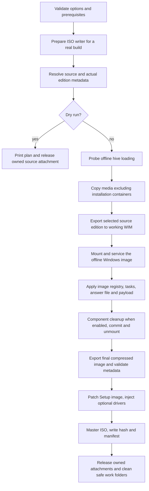

# Project guide: application, architecture and operating contract

Updated **2026-10-05** against application commit `2ae045d`. Read [WORKING_NOTES.md](WORKING_NOTES.md) first for the user's permissions and current verification gaps. This guide explains how the app works so a new agent can choose the correct change location before reading code. It documents implemented behavior, not a promise of successful installation on every Windows version.

## Product and modes

Tiny11 Builder Ultimate Edition is a Windows-hosted PowerShell/WinForms fork of ntdevlabs/tiny11builder. It takes a user-supplied Windows ISO or an existing Windows installation-media drive, selects one edition, patches an offline copy and writes bootable installation media plus a manifest/checksum. It does not distribute Microsoft installation media.

| Mode | Purpose | Behavior |
|---|---|---|
| Standard (`tiny11maker.ps1`) | A reduced Windows installation intended to remain serviceable | Configurable app/file/capability removal, registry policies, payload, normal component cleanup; Update/Store/Defender preserved by the Default preset except explicitly chosen policies |
| Core (`tiny11Coremaker.ps1`) | Disposable minimal test/VM image | Additional component packages removed, WinRE removed, WinSxS rebuilt, Update/Defender disabled, Edge/WebView removed; intentionally not serviceable afterwards |
| GUI (`tiny11gui.ps1`) | Configure and launch either builder | Seven tabs, settings/profiles, real image editions, generated command/plan, hidden child builder, log/progress/ETA/cancel |
| Legacy low-RAM shim (`tiny11LegacyProfile.ps1`) | Compatibility entry point | Delegates to current catalog/profile behavior; not an independent maintained removal engine |

The verified full builds are **Standard, x64 Pro, en-US, 26300.9457**. Architecture/language/other-release support is implemented in planners/readers/answer generation, but those benchmarks do not establish full Core, ARM64, multilingual or driver-enabled installation success.

The batch launchers provide elevation and menu/CLI entry points. Real builds require Windows administrator privileges and local NTFS work storage. Development tests do not require an ISO or image mount. Product labels remain `2026.09`; use commit/evidence provenance to distinguish unreleased October changes.

## Files and responsibility map

| Path | Responsibility / edit here when |
|---|---|
| `tiny11maker.ps1`, `tiny11Coremaker.ps1` | Parameters, early validation, build orchestration, per-mode choices, transcript/trap, output manifests and final work cleanup |
| `lib/tiny11utils.psm1` | Shared native/DISM/registry safety, source mounts, planners, stage functions, answer/payload generation, compression, metadata guard and ISO mastering |
| `lib/tiny11gui.psm1` | GUI state and validation, state-to-CLI translation, hidden process launcher/log tail, progress/timing, controls/events |
| `lib/tiny11media.psm1` | Read-only optical filesystem/WIM XML reader and filename release hints; no servicing or source attachment |
| `lib/OfflineRegistry.cs` | File-only Offreg DWORD patch/readback/security-preserving save for owned image hive files |
| `lib/vendor/DiscUtils/` | Pinned bundled .NET assemblies for UDF/ISO9660 reading; provenance/license/hashes in its README |
| `data/tweaks.psd1` | Registry group IDs/titles/conditions, Set/Delete/Services/FirstBoot entries, notes; catalog source of truth |
| `presets/*.json` + preset helpers | Four named flag combinations and default/fallback behavior; custom JSON inherits missing flags from Default |
| `removePackage.txt` + removal helpers | Default app-prefix list, protected prefixes, optional utility definitions and image-specific planning |
| `data/reference-repos.json`, `scripts/sync-reference-repos.ps1` | Exact studied fork URLs/branches and source-only refresh; not runtime dependencies |
| `Browsers/`, `payload/packages/` | Optional hooks staged into the resulting image; executed after Windows installation |
| `scripts/update-generated.ps1` | Generates APPS/TWEAKS, x64/ARM64 reference answer XML and utils/GUI manifests; editing generated files alone will fail freshness checks |
| `scripts/test-*.ps1`, `parse-check.ps1`, `linter.ps1` | Regression fixtures, AST/command validation, pinned analyzer; source-only traversal |
| `.github/workflows/ci.yml` | PowerShell 5.1/7 tests, export/media/GUI checks, generated freshness/lint and XML/JSON checks |
| `docs/verification/` | Compact committed evidence for dated builds/audits; historical absolute paths are not retained artifacts |
| `repos/`, `logs/`, downloaded `tools/`, build media | Ignored local reference/work files; preserve requested references, clean owned generated media safely |

## Data and option semantics

The four presets are Default, Gaming, PrivacyPlus and Minimal-VM. Flags control app choices and catalog groups. Custom JSON missing flags inherits Default. Core forces its non-serviceable choices; do not infer Core can preserve Update by changing a preset. `-SkipTweak` excludes named registry groups; it does not reverse earlier app/file removals or turn Core into Standard.

App removal matches **prefixes against actual provisioned package inventory**. A missing prefix on a Windows build is normal. Dependency frameworks, App Installer/winget and codecs are protected. `Microsoft.SecHealthUI` is retained on build 26100+ regardless of the Defender-removal request. Optional utilities use separate Keep/Remove choices; a custom prefix list must not quietly override protection. `-KeepApps` bypasses provisioned-app removal, but other chosen Edge/OneDrive/capability/registry actions remain separate.

Standard-only switches include `-Custom`, `-LowRam`, `-DisableDriverUpdates`; Core does not accept those CLI parameters. The GUI omits inapplicable arguments. See [APPS.md](APPS.md) and [TWEAKS.md](TWEAKS.md) for the complete generated current lists, defaults and conditions instead of stale hardcoded counts in prose.

`-ZeroTouch` writes an answer file that wipes **disk 0 on the target installation machine** and selects UEFI/GPT setup. It is not a build-host disk action. Choose a disposable VM/test disk when verifying it. Account passwords are Base64-obfuscated in answer files, not encrypted. GUI settings exclude the password, but the temporary CLIXML launch file contains the build arguments until imported/deleted; logs/custom payloads can also contain user data. First-logon cleanup deletes selected cached answer files and does not prove no copy remains anywhere.

## Build pipeline

### 1. Validation, tools and workspace

Builders normalize list/drive arguments, resolve profiles/presets and validate choices. `-WorkDirectory` must be an absolute local folder, new or empty, on NTFS. It overrides the root-drive work layout, creates `tiny11` / `scratchdir` / optional `scratchdir_boot` beneath it and is recommended for controlled manual runs. Without it, `-SCRATCH` chooses a drive and legacy paths are used at that drive root. A work-folder boundary is not a global lock: the registry aliases and some recovery helpers are shared.

`Test-Prerequisites` imports DISM, including the Windows PowerShell compatibility proxy under PS7. Real builds call `Initialize-Oscdimg` before source resolution/attachment. Installed ADK, script-local user binary and PATH take precedence; otherwise a pinned portable tool is downloaded early, hash-checked, atomically published and retained under `tools\oscdimg\2.56`. DryRun skips that preparation/download. Final mastering uses the prepared path and fails if it is gone rather than downloading at the end.

Source resolution accepts an ISO path or setup-media drive. Source/work trees are checked for overlap before copying/deleting work. An ISO file on the same physical C: volume as the workspace is normal because its attached media has a separate source tree. Original image metadata is saved before export. Indices are actual ISO indices, not a universal “Pro=6” assumption; the selected output is index 1.

DryRun avoids image servicing, exports, disposable hive preflight and mastering, but **does not mean zero filesystem/attachment activity**: it writes a transcript, may attach the source to read DISM metadata, then releases the owned source attachment. Legacy stale-state cleanup occurs before the dry-run branch when no isolated WorkDirectory is supplied. Do not use it as a promise that no recovery command or mount operation can run.

### 2. Fresh first-use input and selected-edition export

Before expensive copy/mount work, `Test-OfflineHiveLoading` creates a disposable tiny image-hive file, tests a unique temporary attachment and removes its own probe after release. A failing probe preserves the native error and stops early. It does not fix the unresolved launch-context cause. `Assert-MountedImage` later performs a real SOFTWARE load/unload test on the mount.

`Invoke-Robocopy` copies setup media excluding original `install.wim`/`install.esd`; Robocopy codes 0–7 are considered successful. `Export-SelectedInstallImage` exports only the chosen edition. Ordinary WIM resources with compatible compression can be copied without re-encoding (LZX stays LZX; XPRESS stays XPRESS). Solid ESD inputs must be converted to a non-solid servicing WIM. Temporary `.edition.tmp.wim` output is checked before publication; existing export/temp paths are refused rather than treated as resume data. Auto prefers pinned wimlib; Dism uses the inspected native export path.

The optimization is from the user's **original source**, on the first run. No patched checkpoint or previous application cache is reused. The OS filesystem cache is outside this claim.

### 3. Offline servicing and registry

DISM mounts the working installation WIM at `scratchdir`. Standard removes planned provisioned apps/capabilities and chosen Edge/OneDrive files; optional .NET 3.5 and driver injection apply to the offline image. Core also removes component packages/WinRE and rebuilds WinSxS before registry/payload work. Core's existing offline WinSxS long-path `cmd/rmdir` fallback is **not** the guarded scratch-directory deletion helper; do not claim this separate path was removed in the #623 fix.

The registry stage loads owned image hives under `HKLM\zSOFTWARE`, `zSYSTEM`, `zNTUSER`, `zDEFAULT`, `zCOMPONENTS`. `Set-RegistryValue`/`Remove-RegistryValue` reject live/lookalike/unloaded paths. Catalog `ControlSet001` is a template resolved through that image SYSTEM hive's `Select\Default`, which chooses the next boot. Missing/invalid selection or absent target set fails rather than guessing. Service existence/start and deletes follow the selected set; state resets on unload. `CurrentControlSet` is not used in offline catalog entries. Explicit other sets and non-control-set keys remain literal.

Access-denied **DWORD** writes alone are queued for the tracked image hive and retried through `OfflineRegistry.cs` after normal unload. Values are read back, saved and replaced preserving file security. Unsupported types/other failures are not silently converted into success. This avoids changing host registry ACLs and does not establish that ACLs caused the original denial.

Telemetry task removal operates on the offline task definition and TaskCache entries. It strips the NUL terminator from GUID IDs before constructing commands and logs each target. Some individual app/tweak/cleanup failures are counted warnings; critical mount/export/metadata/ISO failures abort. Therefore an exit 0 with warnings is not a claim that every requested patch applied: read the manifest/log and independently inspect relevant saved state.

### 4. Payload, cleanup and final export

The mounted image receives generated/custom answer files, SetupComplete and FirstLogon scripts. Existing OEM SetupComplete is preserved and chained. FirstBoot catalog commands and optional payload files run after installation; browser scripts run at first sign-in, never on the build host during image creation. Payload top-level files except README are copied; nested directories are not recursively staged by the current helper. Runtime order is all `.cmd` scripts then all `.ps1` scripts, not one globally interleaved prefix sequence.

Standard normal component cleanup uses native offline DISM `/StartComponentCleanup /ResetBase`; `-Fast` skips it. The builder then unloads hives and commits/unmounts. Core's reduction is materially different and cannot be compared with Standard as an equivalent image.

| Public compression | Final file / encoding | Historical DISM name |
|---|---|---|
| `maximum` (default) | `install.esd`, solid LZMS; wimlib effort 100, 64 MiB solid chunks | `recovery` |
| `balanced` | `install.wim`, LZX | `max` |
| `fast` | `install.wim`, XPRESS | `fast` |
| `none` | `install.wim`, uncompressed | `none` |

`-Fast` means fast compression **and** skipped cleanup. An explicit `-Compress` wins for the compression choice while cleanup is still skipped. Thus `-Compress maximum -Fast` is maximum compression without normal cleanup; the historical `none -Fast` measurement is not identical servicing state to normal maximum. `-CompressionEngine Auto|Wimlib|Dism` selects the backend: Auto permits a reported fallback, Wimlib requires that backend, Dism explicitly chooses the native DISM export. `-CompressionLevel 1..200` defaults to 100 and affects wimlib effort; `-CompressionThreads 0..1024` defaults to zero. Level/thread options affect wimlib; zero threads omits the option so wimlib chooses CPUs within its memory constraints. High CPU priority and parallel DISM writers are not app optimizations.

`Export-FinalInstallImage` writes a checked temporary export, requires a nonempty file, replaces the final container with bounded retries and removes the intermediate when appropriate. `Assert-InstallImageMetadata` then requires one image and the actual source edition/flags/architecture/version/product/installation/languages. Valid metadata is a read-only no-op. Only missing source-derived Windows metadata is repaired through `wimlib info --image-property --check`, followed by mandatory readback; conflicts and incomplete source metadata fail. No raw header-size rewrite, integrity-table clearing or Pro/en-US relabeling is used. Missing-field repair requires wimlib even if DISM performed the export.

### 5. Setup image and final ISO

Without drivers, where Offreg/wimlib are available, `Invoke-BootImageFilePatch` extracts and updates small Setup hive files with strict metadata preservation instead of mounting/committing the whole boot image. Drivers or fallback use a separately initialized `scratchdir_boot`, add drivers and commit it. Boot index selection comes from the actual boot image rather than assuming an arbitrary install index.

`New-Tiny11Iso` refuses duplicate/temporary/split installation containers and requires exactly one `install.wim` or `install.esd`. Oscdimg packages that container with the setup media and boot entries; it does not compress the entire disc again. x64 media has BIOS/UEFI boot entries, ARM64 UEFI; NoPrompt selects the appropriate boot file. Output validation checks native result/presence/minimum size, then `Write-BuildManifest` computes SHA-256 and writes `<iso>.json` / `<iso>.sha256`. These are build/output checks, not a complete install test.

Success releases the source ISO only if the builder attached it and cleans guarded scratch/media work. Failure traps and GUI Cancel attempt hive unload, image discard, owned ISO release and optional exclusion cleanup. Scratch deletion refuses reparse points or registered mounts. Failed dismount/unknown mount state preserves image files. Cleanup is best-effort; verify leftovers before another run. Legacy `Clear-StaleBuildState` may unload shared z* aliases and call global DISM mountpoint cleanup; it must not run alongside another servicing job.

## GUI and read-only source selection

The seven tabs cover Source, Preset/features, Apps, Tweaks, Setup/account, Extras and Build. Save/load settings excludes passwords. Custom flags/prefix lists become generated project-local request files; `ConvertTo-GuiBuildRequest` is the GUI-to-builder contract. The GUI starts the same PowerShell edition in a hidden process. Arguments travel through an immediately consumed CLIXML file; the launcher records `__TINY11_EXIT__ <code>` and ordinary log output. The tail reader holds only partial lines/position.

`Get-IsoImageEditions` uses bundled DiscUtils to read the optical directory and the embedded WIM XML resource. XML is size/offset bounded, DTD processing prohibited, external resolver disabled, and file streams disposed. Selection does not require mount/elevation/network/application caching. Unsupported encrypted/split/compressed-XML media should fail transparently rather than return fictional editions. Existing source drives use their metadata route. A filename hint can appear before parsing but must never select a fabricated edition/index.

`Write-BuildProgress` emits `__TINY11_PROGRESS__` JSON records. `Get-GuiStepProgress` combines explicit stage counts/percentages with native progress for eligible stages; unrelated numbers in policy text must not move the bar. Overall percent maps stage progress into fixed ranges and is therefore an estimate, not elapsed-time completion. Unknown progress animates. `Get-GuiTiming` estimates a current step only from sufficiently recent measured progress and labels total remaining time rough. Compression, integrity passes and I/O can have different rates; ETA is not a promise.

Visible GUI controls expose compression mode and work drive, **not** isolated WorkDirectory. Engine/effort/thread values are persisted/forwarded from GUI state/profile but lack dedicated visible selectors. Use the CLI for explicit isolated-work control. Controlled manual CIM/WMI `Win32_Process.Create` launching passed the reproduced hive-load test. No automatic CIM/WMI launch workaround or global cross-process builder lock is implemented.

## Dependencies and updates

| Component | Current project pin / source | Use |
|---|---|---|
| DiscUtils Core/Streams/Iso9660/Udf | 0.16.13, bundled MIT assemblies and SHA-256 provenance | Offline first-use optical metadata reading |
| wimlib | 1.14.5 Windows x86_64 portable distribution, archive/exe/DLL hash pins, project cache | Initial/final export, metadata repair, boot file updates; ARM64-host execution is not established by x64 benchmarks |
| Oscdimg | Installed/user/PATH tool preferred; Microsoft standalone 2.56 fallback, SHA pin, retained cache | ISO mastering; early preparation from #604 |
| PSScriptAnalyzer | 1.25.0 installed read-only module or pinned project-local fallback | Development lint only |
| Windows DISM/Storage/WinForms/.NET/Offreg | Existing host components; PS7 compatibility import for DISM | Image servicing, source attachment, UI and file-only hives |
| checkout/upload-artifact Actions | v7.0.1 workflow pins | CI checkout / screenshot upload only |

These are the **configured pins**, not a statement that no newer release can ever exist. No startup release-feed polling or host installer/update is used. Updating a pin requires checking official provenance, replacing/verifying associated hashes and running relevant fixtures. Browser “latest” downloads occur in the resulting installed Windows, outside ISO compression measurements. Retained tool binaries are not cached patched Windows data.

## Development and remaining work

Use [CONTRIBUTING.md](../CONTRIBUTING.md) for change locations/commands and [VERIFICATION.md](VERIFICATION.md) for the test matrix and limits. Use the reference review for adopted/excluded upstream ideas, not wholesale script replacement. Preserve a small repository: media/work/logs are ignored, compact evidence is tracked, and the 21 user-requested source checkouts remain local.

Principal open work is a fresh full current-code Standard run plus a disposable VM boot/install; unresolved normal-launch hive compatibility; broader platform/driver/Core validation; and the currently absent visible advanced workspace/compressor controls. Existing reports do not assert those items are finished. Future concurrency/cleanup or Core WinSxS changes must account for shared aliases/global recovery and validate owned absolute offline targets before destructive operations.
